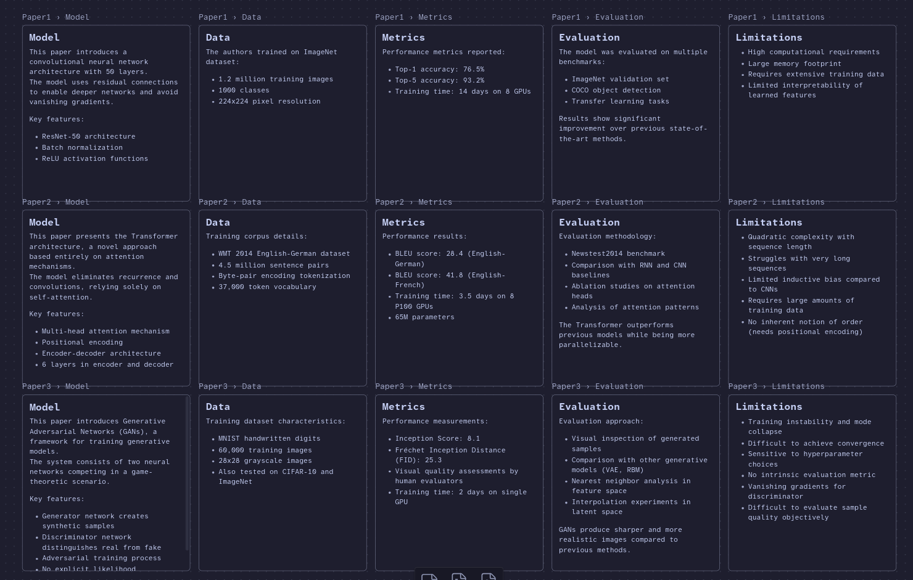

# Obsidian Canvas Table Generator

A Rust CLI tool that generates Obsidian canvas files for comparison tables. This tool creates a grid layout where each row represents a markdown file and each column represents a heading section within those files.

Store your data like this: 


Compare it like this:


> Use of AI: This tool was created using Claude Sonnet 4.5 via the Zed Editor's AI console.

## Features

- Automatically scans a folder for markdown files
- Generates a grid layout with files as rows and headings as columns
- Customizable node dimensions and spacing
- Supports relative or absolute file paths
- Outputs standard Obsidian `.canvas` format

## Installation

### From Source
Required: `git`, `cargo`.

Clone this repo, `cd` into it.

```bash
cargo build --release
```

The binary will be available at `target/release/obsidian-canvas-table`.

or 

```bash
cargo install .
```

## Usage

### Basic Usage

*Run from the root of your Obsidian vault providing the full path from there*

```bash
obsidian-canvas-table --folder /path/to/markdown/files --headings "Model,Data,Metrics,Evaluation,Limitations" --output comparison.canvas
```

Then simply open `comparison.canvas` in Obsidian.

### Command Line Options

- `-f, --folder <PATH>` - Path to the folder containing markdown files (required)
- `-H, --headings <LIST>` - Comma-separated list of headings to include as columns (required)
- `-o, --output <PATH>` - Output canvas file path (default: `output.canvas`)
- `-w, --width <NUM>` - Width of each node in pixels (default: `400`)
- `-e, --height <NUM>` - Height of each node in pixels (default: `420`)
- `-x, --spacing-x <NUM>` - Horizontal spacing between columns in pixels (default: `20`)
- `-y, --spacing-y <NUM>` - Vertical spacing between rows in pixels (default: `20`)
- `-b, --base-path <PATH>` - Base path for relative file paths in canvas (optional)

### Examples

#### Example 1: Basic Literature Review Table

```bash
obsidian-canvas-table \
  --folder "Papers/2026" \
  --headings "Model,Data,Metrics,Evaluation,Limitations" \
  --output comparison.canvas
```

#### Example 2: Custom Dimensions

```bash
obsidian-canvas-table \
  --folder ./papers \
  --headings "Introduction,Methods,Results,Discussion" \
  --output review.canvas \
  --width 500 \
  --height 300 \
  --spacing-x 30 \
  --spacing-y 40
```

#### Example 3: With Base Path for Relative Paths

```bash
obsidian-canvas-table \
  --folder ~/Documents/Research \
  --headings "Problem,Approach,Findings" \
  --output research.canvas \
  --base-path ~/Documents
```

#### Example 4: Headings with # Symbol

You can specify headings with or without the `#` symbol:

```bash
obsidian-canvas-table \
  --folder ./notes \
  --headings "#Summary,#Analysis,#Conclusion" \
  --output notes.canvas
```

Or without (the tool will add them automatically):

```bash
obsidian-canvas-table \
  --folder ./notes \
  --headings "Summary,Analysis,Conclusion" \
  --output notes.canvas
```

## How It Works

1. The tool scans the specified folder recursively for all `.md` files
2. For each markdown file and each heading combination, it creates a node in the canvas
3. Nodes are arranged in a grid:
   - Each row represents a different markdown file
   - Each column represents a different heading section
4. The canvas file is output in JSON format compatible with Obsidian

## Canvas Structure

The generated canvas follows the Obsidian canvas format:

```json
{
  "nodes": [
    {
      "id": "unique-hex-id",
      "type": "file",
      "file": "path/to/file.md",
      "subpath": "#Heading",
      "x": 0,
      "y": 0,
      "width": 400,
      "height": 420
    }
  ],
  "edges": []
}
```

## Use Case: Literature Reviews

This tool is particularly useful for academic literature reviews where you want to compare multiple papers across common dimensions:

1. Create a folder with your literature review notes (one `.md` file per paper)
2. Ensure each paper's notes include standard headings (e.g., `## Model`, `## Data`, `## Metrics`)
3. Run the tool to generate a canvas that displays all papers in a comparison table
4. Open the canvas in Obsidian to view and navigate your comparison table

## Requirements

- Rust 1.70+ (for building from source)
- Obsidian (for viewing the generated canvas files)

## License

MIT

## Contributing

Contributions are welcome! Please feel free to submit a Pull Request.
